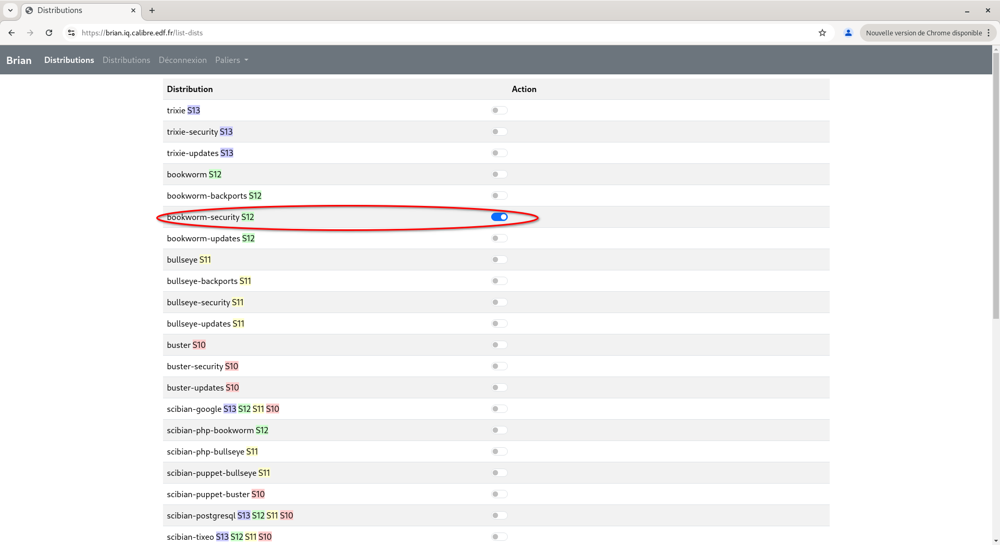
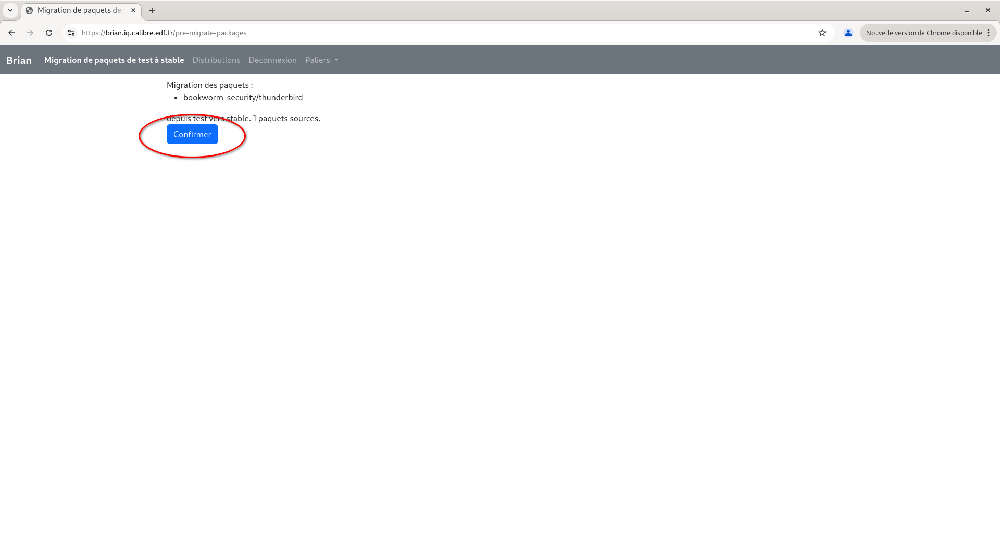

# Jenny, an APT repository manager

It was initially named Brian (because Python, and -ian and, well, find
your own backronym), but when we decided to open it to the world we
noticed that there was already a piece of software in Debian by that
name. So we switched to Jenny, the sister of Brian.

We haven't finished renaming everything in the code yet.

## Purpose

Brian is a tool to manage Debian package repositories for a
Debian-like distribution. It handles incoming packages either built
locally or mirrored from external sources, follows them through phases
of development (called "environments"), and publishes them as
repositories usable by `apt` and related tools.

Brian was initially developed to handle [Scibian](https://scibian.org), a Debian derivative
distribution in use for scientific computing at EDF; it should,
however, be generic enough to be useful in other contexts. Scibian is
used as an example in the following README, as well as in the example
configuration file.

## Concepts

### Stage

Stages are major versions of Scibian, based on the corresponding major
Debian version. For instance, in 2024, four stages were current: S10,
S11, S12 and S13, which follow Debian 10 Buster, Debian 11 Bullseye,
Debian 12 Bookworm and the then-future Debian 13 Trixie. Stages are
only useful as display filters but they have no other function.
They're defined in the `stages` section of the configuration file.

### Distribution

A distribution is a consistent set of packages, possibly from a given
external source. Brian handles two types of distributions:

- Mirrors: they're replicated from external package repositories. For
  instance, `bookworm` and `bookworm-backports` are two distributions
  replicated from Debian's official repository for Debian 12 Bookworm
  (the main part and the backports part); `scibian-postgresql` is
  replicated from PostgreSQL's repository; `scibian-php-bookworm` is
  Ondřej Surý's repository dedicated to packaging various PHP versions
  for Bookworm.

- Repositories: they're independent, local sets of packages. The
  contents of these repositories come from locally-built packages
  and/or from packages picked up from mirrors and manually *migrated*
  into a repository.

Each distribution (be it a mirror or a repository) is attached to one
or more stages. For instance, `bookworm` is S12 only, but
`scibian-postgresql` spans S10, S11 and S12.

Distributions are defined in the `dists` section of the configuration
file.

### Environments

Each distribution has several environments, usually two (`test` for
development and `stable` for production-ready) or three (`dev` for
development, `iq` for integration/qualification and `prod` for
production).  Packages are meant to be initially injected into the
first environment, then migrate to the other(s).

Environments are defined in the `environments` section of the
configuration file.

## Requirements

The following packages are required (on Debian/Scibian environments):
`aptly`, `aptly-api`, `python3-aptly`, `python3-aptly-api-client`,
`python3-inotify`. Systemd service files are provided, but not
required.

## Installation

A manual installation involves:

- deploying the files somewhere;
- installing the prerequisites (see [Requirements](#requirements)
  above);
- adapting the `config.yaml` file;
- running the Initialization phase (see
  [Initialization](#initialization) below);
- deploying and running the Systemd services.

The deployment and configuration is straightforward and can be
automated with Ansible/Puppet/etc.

## Workflow

Packages initially enter Brian either from a mirror or from a local
build.

Besides the origin of the contents, mirrors have three differences with
repositories:

- they are only present in the first environment (`test`);
- they cannot be the destination of a package migration (their
  contents only comes from the replicated source);
- packages in them cannot be removed manually, they only disappear
  during a sync if they're no longer in the replicated repository.

Once a package is present in a distribution, it can be migrated to
another environment of the same distribution. For instance, a package
in the `test` environment of `bookworm` (ie. straight from the Debian
mirrors) can be migrated to the `stable`
environment. Similarly, if a rollback is needed, a package in
`scibian12--stable` (ie. the `stable` environment of `scibian12`) can be
"down-migrated" to `scibian12-test`.

## Operations

### Initialization

When starting a Brian instance from scratch, or after a change in
configuration, the first operation to run is `brian.py init`. This
creates the data structures and configures the `aptly` backend, and it
also imports the GPG keys used for verifying archive signatures.

This command should probably only be run by hand when `config.yaml` file changed

Actually, this commands supports :

- Updating (add or remove) components of dists (Updating a repo, mirror and associated published repository in the aptly sense)
- Updating (add or remove) architectures of dists (Updating a repo, mirror and associated published repository in the aptly sense)
- Updating (modify) url of mirror
  DISCLAIMER : Currently, this action drops and recreates the impacted publish repository
- Updating all other fields of `config.yaml` file
- Clean up mirrors, repos and published repository disabled in config.yaml

### Mirror updates

`brian.py update` tells `aptly` to pull the contents of the external
mirrors into the local structures. This step can take quite some time
on the first run, but following runs will fetch the data incrementally
and be much faster.

Reminder: the external mirrors are only replicated in the first
environment (`test`).

This command is run periodically by the `brian-update` systemd service
and timer.

### Package manipulation

The web interface is the main UI for Brian. It provides the following
features:

- display the contents of one distribution (mirror or repository);
- display the differences between two environments of a set of
  distributions, for instance the `test` and `stable` environments across
  `bookworm`, `bookworm-backports`, `bookworm-security` and
  `bookworm-updates`;
- migrate a set of packages from one environment to another within the same
  distribution (the target distribution needs to be a repository);
- remove a package from one distribution (repository only).

The web interface is meant to be used by hand.  It is started by the
`brian-web` systemd service.

For instance, to migrate a package from `test` to `stable`:

- first, select a distribution (or several distributions) on which to
  work: 
- then click on the "Comparer…" button 
- select a source package: 
- trigger the migration: 
- a summary of the proposed changes appears; confirm those changes:
  
- when the migration is done, a feedback page appears with all the
  packages that were migrated: 

### Package inclusion

Packages can be included in a distribution in two ways. Both ways
require an "upload", which is a full set of files with the
corresponding `*.changes` file.

- For manual inclusion, run `brian.py include-changes <dist> <foo>.changes`.
- You can also store the "upload" in the `incoming` directory; the
  `brian-incoming` systemd service runs a daemon that watches that
  directory with `inotify` and processes uploads as soon as they
  arrive.

### Publication

Once the contents of the distributions are considered to be in a
consistent state, `brian.py publish <target>` generates the actual APT
repository, with its package pool and metadata files. `<target>` can
either be an environment (`test`/`stable`) or `all` to
generate all repositories at once.

To avoid any risk of publishing inconsistent repositories, it is
advised to only run this command by hand.

The published repositories can be on the local filesystem or on S3
buckets that are available over HTTP.

## Configuration

Brian is configured by way of a `config.yaml` file using the YAML
syntax, describing a hierarchical data structure. The top-level
structures are:

- `environments`: a list of strings describing the environments. The
  first one listed is special: it's where the mirrors replicate their
  external sources.
- `stages`: a dict of major Scibian versions; key is the name of the
  stage, value is a dict of its attributes; currently, only the `color`
  attribute is defined: it contains an HTML description of a color
  (eg. `#CCFFCC`) that is used to highlight the relevant stage on the
  web interface.
- `dists`: a dict of distributions; key is the distribution name,
  value is a dict of its attributes. The `_default` distribution name
  is special: it serves as fallback values for attributes in other
  distributions unless overridden. The attributes themselves are:
  - `origin`, `label` and `description`: currently unused;
  - `architectures`: a list of architectures to handle
    (eg. `[source, amd64]`);
  - `components`: a list of components to handle (eg. `[main, contrib, non-free, non-free-firmware]`);
  - `udebs`: a boolean, whether to handle udebs for the installer in
    the distribution;
  - `upstream` and `suite`: for mirrors, the URL of the external
    repository and the suite within that repository to be replicated;
  - `verifyrelease`: for mirrors, a `|`-separated list of GPG key ids
    used to validate the signature on the external repository;
  - `stages`: a list of stages that this distribution belongs to.
  - `proxy`: the URL of the proxy to use when replicating mirrors.
- `publishes`: a dict of repositories to generate. Key is the name of
  the published repository, value is a dict of attributes:
  - `type`: currently only `filesystem` is supported;
  - `dists`: a list of distributions to include in the published
    repository;
  - `env`: the environment to use when generating the repository;
    assumed to be equal to the publish name if missing;
  - `suffix`: a suffix to be appended to the distribution names when
    published.

The YAML syntax allows defining lists either inline `[foo, bar, baz]` or in block style:

```
- foo
- bar
- baz
```

Similarly, dicts can be defined either inline `{foo: bar, baz: quux}` or in block style:

```
foo: bar
baz: quux
```

## Administrative tasks

### Adding or removing a repository or a mirror

Adding/removing a new repository/mirror requires the following steps:

- add the relevant entry in the `config.yaml` file;
- update `aptly`'s internal database by re-running `brian.py init`. This won't erase existing data;
- restart the web UI so that the `aptly` process is restarted with its
  new configuration file;
- also restart the `brian-incoming` service, for the same reason.

These required steps can be orchestrated by a central configuration
deployment system such as Ansible or Puppet or the like. Be sure to
trigger the last three steps whenever the configuration file's
contents change.

## TODO

See https://salsa.debian.org/debian/jenny/-/work_items

## Authors, copyright, licensing

Brian is released under the terms of the GNU Affero General Public
License, version 3 or any later version.

See `AUTHORS` for a list of authors.
